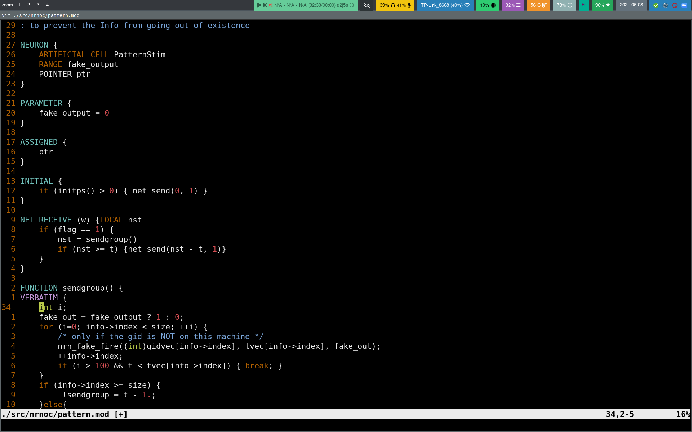

# Highlight Mod file inside vim

## Installation

### With native vim package manager
With vim >= 8 you can use the package mechanism directly included inside vim.

```
mkdir -p ~/.vim/pack/user/start
cd ~/.vim/pack/user/start
git clone https://github.com/alkino/vim-mod-syntax
```

It will now directly work when you open a file ending with `.mod`.

If the file does not end with `.mod`, once the file is open type
```
:set filetype=Mod
```
### With vim-plug
Works directly with:

```
call plug#begin()
Plug 'alkino/vim-mod-syntax'
call plug#end()
```

## Example

Here, is an example of coloring


